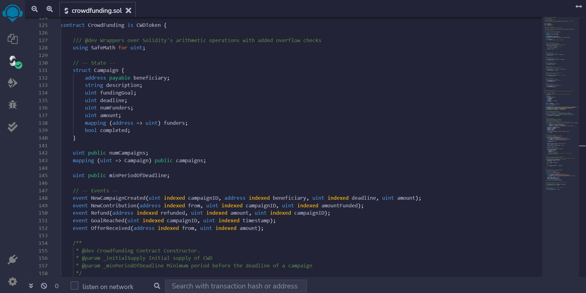

<div id="top"></div>
<!-- PROJECT LOGO -->
<br />
<div align="center">
  <a href="https://github.com/RichardPy02/decentralized_crowdfunding_platform">
    
  </a>

  <h3 align="center">Decentralized Crowdfunding Platform</h3>

  <p align="center">
      Dapp project implementing Ethereum Smart Contracts and a Django application to listen to emitted events periodically stored in a MongoDB
    <br/>
    <!-- <a href=""><strong>Visit the website »</strong></a> -->
  </p>
</div>


<!-- TABLE OF CONTENTS -->
<details>
  <summary>Table of Contents</summary>
  <ol>
    <li>
      <a href="#about-the-project">About The Project</a>
      <ul>
        <li><a href="#built-with">Built With</a></li>
      </ul>
    </li>
    <li>
      <a href="#getting-started">Getting Started</a>
      <ul>
        <li><a href="#prerequisites">Prerequisites</a></li>
        <li><a href="#installation">Installation</a></li>
      </ul>
    </li>
    <li><a href="#usage">Usage</a></li>
    <li><a href="#contributing">Contributing</a></li>
    <li><a href="#contact">Contact</a></li>
  </ol>
</details>


<!-- ABOUT THE PROJECT -->
## About The Project



This project, realized for educational purposes, regards building a decentralized crowdfunding platform handled by an ethereum 
[smart contract](https://ropsten.etherscan.io/address/0x86D219D65452b013912B2af7b2E65E903fa3777d)
(deployed on Ropsten Testnet) where users can interact with it and create new campaigns, contribute to existing ones and receive special platform tokens (CWD Token) as reward for their actions.
Moreover, a website, created with a web framework (in this case [Django](https://www.djangoproject.com/)) using Redis and MongoDB, displays events emitted by the smart contract, which are all stored in a Redis database and
then periodically stored in MongoDB. 

<p align="right">(<a href="#top">back to top</a>)</p>


### Built With

* [Solidity](https://docs.soliditylang.org/en/v0.8.11/)
* [Truffle](https://trufflesuite.com/truffle/)
* [Ganache](https://trufflesuite.com/ganache/)
* [Remix](https://github.com/ethereum/remix-desktop/releases)
* [Javascript](https://www.javascript.com/)
* [Nodejs](https://nodejs.org/it/)
* [Python](https://www.python.org/)
* [Django](https://www.djangoproject.com/)
* [MongoDB](https://www.mongodb.com/)
* [Redis](https://redis.io/)

<p align="right">(<a href="#top">back to top</a>)</p>


<!-- GETTING STARTED -->
## Getting Started
These simple instructions will help you to set your environment and try my project locally on your machine.

### Prerequisites

This project assumes you have already installed [Python](https://www.python.org/downloads/) (at least 3.9.9 version), [Redis](https://redis.io/download) (at least 6.2.6 version), MongoDB (in case you need help check this [guide](https://www.html.it/pag/52332/installazione-2/)),
Truffle, Ganache, Nodejs (if you need help check software homepages) on your system.

### Installation

1. Clone the repo
   ```sh
   git clone https://github.com/RichardPy02/decentralized_crowdfunding_platform.git
   ```
2. Install external packages using requirements.txt file
   ```sh
   pip install -r /path/to/requirements.txt
   ```

<p align="right">(<a href="#top">back to top</a>)</p>

<!-- USAGE EXAMPLES -->
## Usage

Once you set your environment, to run the server locally you just need to:
* Initialize the database only one time by executing this command from your prompt (assuming you're in folder project directory (crowdfunding folder): "python manage.py migrate".
* Activate and connect to a redis server. If you are on windows, open your linux extension (for instance Ubuntu LTS) and execute the command "redis-server".
* Run on your command prompt "python manage.py runserver" and go to http://127.0.0.1:8000/ on your browser. 

Notes: <br>
Contract events are showed when someone interact with it, so if you don't personally want to interact with the contract or wait for, open an other terminal and execute the
"tests.py" file in django project (path: crowdfunding/events/) by executing "python events.py". It will simulate an interaction with the smart contract and you will be able to see
the emitted events from the website.

I hope you enjoy it ;).


<!-- CONTRIBUTING -->
## Contributing

Contributions are what make the open source community such an amazing place to learn, inspire, and create. Any contributions you make are **greatly appreciated**.

If you have a suggestion that would make this better, please fork the repo and create a pull request. You can also simply open an issue with the tag "enhancement".
Don't forget to give the project a star! Thanks again!

1. Fork the Project
2. Create your Feature Branch (`git checkout -b feature/AmazingFeature`)
3. Commit your Changes (`git commit -m 'Add some AmazingFeature'`)
4. Push to the Branch (`git push origin feature/AmazingFeature`)
5. Open a Pull Request

<p align="right">(<a href="#top">back to top</a>)</p>

<!-- CONTACT -->
## Contact

Riccardo, 
Personal email address: riccardomagni00@gmail.com

Project Link: [https://github.com/RichardPy02/btc-decentralized_crowdfunding_platform](https://github.com/RichardPy02/decentralized_crowdfunding_platform)

<p align="right">(<a href="#top">back to top</a>)</p>
